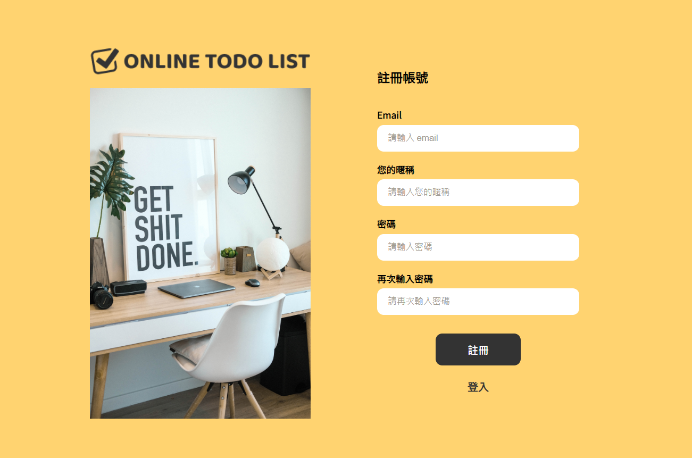
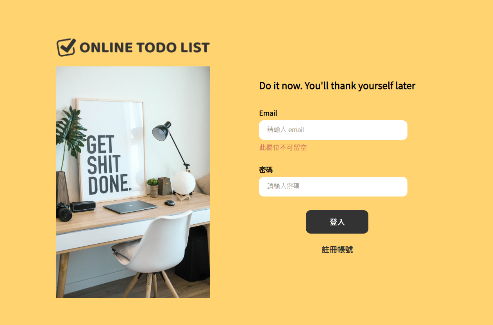
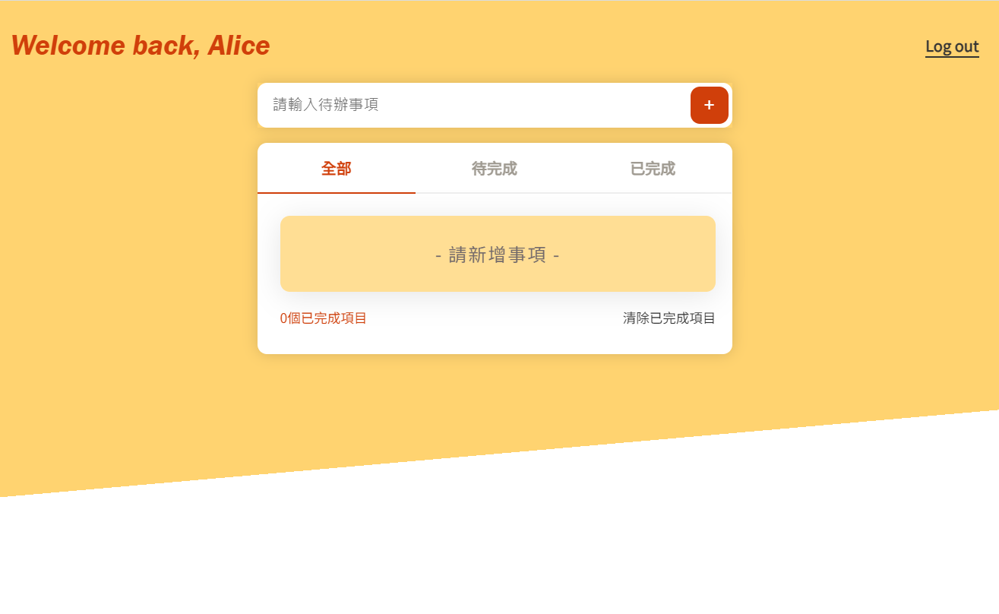
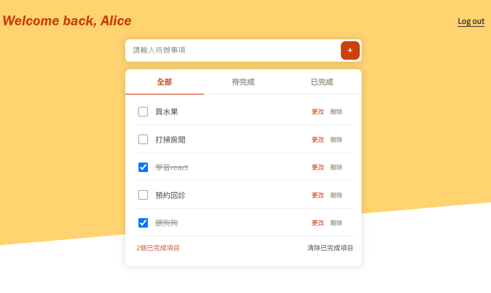
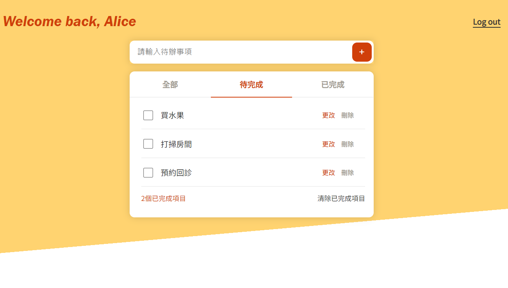

## Online To-Do List: 

Welcome to **Online To-Do List**, a React-based web application designed to keep your tasks organized and prioritized. This project showcases my proficiency in React development, and integrating and consuming APIs.

---

### 🚀 Live Demo

Experience the **Online To-Do List** in action! Check out the live demo hosted on GitHub Pages:

[Online To-Do List Live Demo](https://alicezhao0111.github.io/react-to-do-list/)

---

### Features

1. **User Authentication**:
   - **Register**: New users can easily create an account.
   - **Login**: Returning users can log in securely.
   
   

2. **Personalized To-Do Page**:
   After logging in, users will be presented with their personalized to-do page.
   - **Add Items**: Quickly add new tasks.
   - **Edit Items**: Need to make a change? No problem! Edit your tasks on-the-fly.
   - **Filter Function**: With our advanced filtering, users can easily categorize and view their tasks based on:
     - **All**: View all tasks.
     - **To-Do**: Focus on tasks that are pending.
     - **Finished**: Reflect on completed tasks.
     
   
   
   

---

### 🔧 Built With

- **React**
- **Vite**
- **Bootstrap**

---

### Why This Project?

This application is a testament to my capabilities as a front-end developer. Not only does it showcase my skills in React and front-end development, but it also demonstrates my understanding of integrating with backend services via APIs.

---

Thank you for stopping by, hope you have a lovely day, Alice :smiley:

